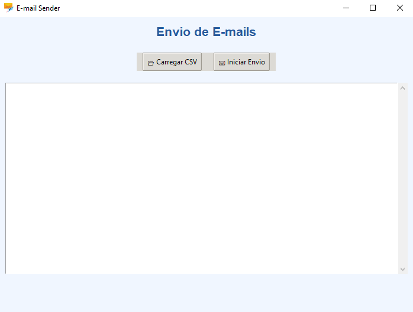

<h1 align="center">AutoMailerX - Envio Automatizado de E-mails com Python 💌</h1>

<p align="center">
  
  
  
  
</p>

---

## ✨ Sobre o Projeto

Este é um **aplicativo desktop** desenvolvido em Python que permite o envio de e-mails personalizados em massa, utilizando dados de um arquivo **CSV** contendo nomes e e-mails. Ideal para convites, confirmações de inscrição, notificações ou qualquer outro tipo de comunicação automatizada.

---

## 🧰 Tecnologias Utilizadas

- 🐍 **Python 3.9+**
- 📊 **Pandas** para manipulação de dados em CSV
- 💻 **Tkinter** para interface gráfica (GUI)
- ✉️ **SMTP (smtplib)** para envio de e-mails
- 📑 **MIME** para formatação do e-mail em HTML
- 🔐 **Threading** para evitar travamentos durante o envio

---

## 📸 Interface da Aplicação



---

## 📁 Estrutura Esperada do Arquivo CSV

O arquivo CSV deve conter **duas colunas obrigatórias** com os cabeçalhos:

```
nome,email
João Silva,joao@email.com
Maria Oliveira,maria@email.com
...
```

⚠️ O sistema ignora registros com nome ou e-mail ausentes.

---

## 🚀 Como Usar

### 1. Clone o repositório

```bash
git clone https://github.com/seunome/email-sender-app.git
cd email-sender-app
```

### 2. Instale as dependências

```bash
pip install pandas
```

> As demais bibliotecas (Tkinter, smtplib) já vêm com o Python padrão.

### 3. Configure suas credenciais

Edite as seguintes variáveis no topo do arquivo Python:

```python
EMAIL_REMETENTE = 'seuemail@gmail.com'
SENHA = 'suasenha'
ASSUNTO = 'Título do E-mail'
LOGO_URL = 'https://seudominio.com/sualogo.png'
```

> ⚠️ Use senhas de app do Gmail caso tenha autenticação em dois fatores.

### 4. Execute o programa

```bash
python email_sender.py
```

---

## ✉️ Conteúdo do E-mail

O corpo do e-mail é em HTML, com saudação personalizada com o nome da pessoa e links editáveis. Inclui também uma imagem de logotipo no final (inserida por URL).

---

## 🕹️ Funcionalidades

- ✅ Interface gráfica simples e intuitiva
- ✅ Leitura de dados a partir de arquivos CSV
- ✅ E-mails personalizados com HTML
- ✅ Envio em **lotes de 50** com intervalo de segurança
- ✅ Status em tempo real no app
- ✅ Multi-thread para não travar a interface

---

## 📌 Recomendações

- Não utilize para spam.
- Respeite os limites do servidor SMTP (ex: Gmail limita 500 emails/dia).
- Sempre teste com sua conta antes de realizar envios em massa.

---

## 🛡️ Licença

Distribuído sob a licença **MIT**. Veja `LICENSE` para mais informações.

---

## 🤝 Contribuição

Contribuições são bem-vindas! Sinta-se à vontade para abrir _issues_ ou enviar _pull requests_.

---

<p align="center">
  Feito por <strong>Rochi</strong>
</p>
